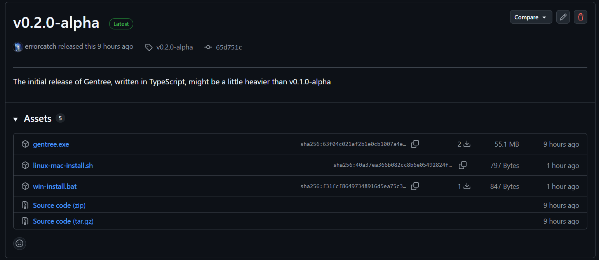
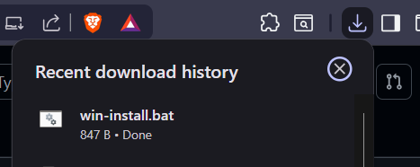

# Gentree Installation Guide
## 1. Locate releases

## 2. Download win-install.bat/linux-mac-install.sh (Windows - .bat, Mac, Linux - .sh)



## 3. Left-click the installed file


## 4. Ignore Security Warning & left-click 'Run'


## 5. Run ```gentree -V``` & check if Gentree has installed


